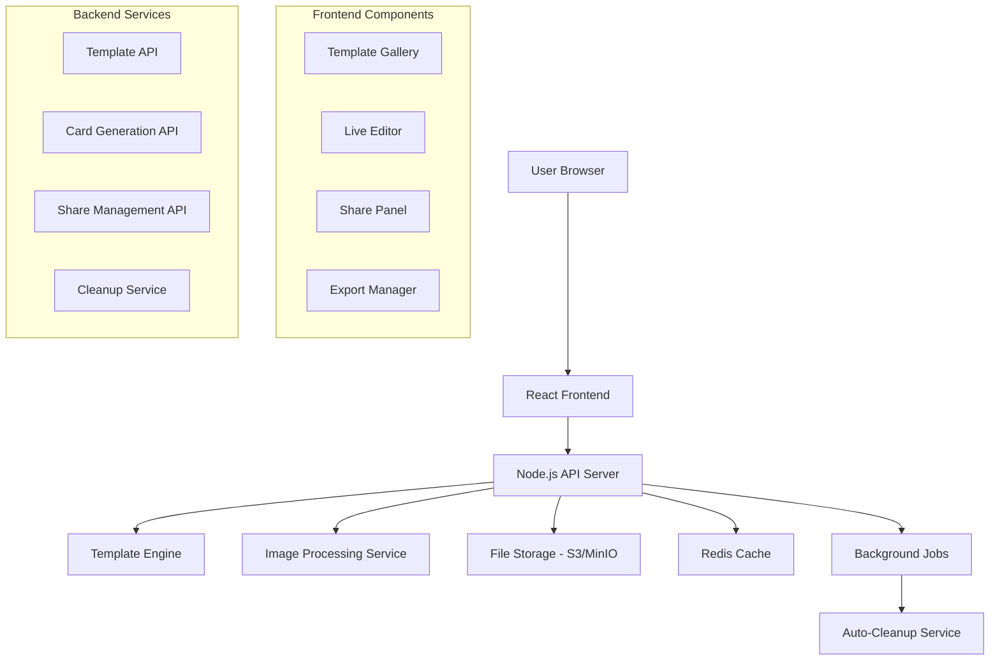

# Design Document

## Overview

The Goan Wedding Invitation Card Generator is a comprehensive web application that allows users to create, customize, and share beautiful wedding invitations without requiring account registration. The system follows a stateless, privacy-first approach with automatic data cleanup and seamless social sharing integration.

## Architecture

### High-Level Architecture



### Technology Stack

**Frontend:**
- React 18 with TypeScript
- Vite for build tooling
- Tailwind CSS for styling
- Fabric.js or Konva.js for canvas-based editing
- React Query for state management
- Wouter for routing

**Backend:**
- Node.js with Express/Fastify
- TypeScript
- Sharp for image processing
- Canvas API for server-side rendering
- Redis for temporary storage and caching
- AWS S3 or MinIO for file storage

**Infrastructure:**
- Docker containers
- Background job processing (Bull/Agenda)
- CDN for template assets
- Environment-based configuration

## Components and Interfaces

### Frontend Components

#### 1. TemplateGallery Component
```typescript
interface TemplateGalleryProps {
  onTemplateSelect: (template: InvitationTemplate) => void;
  categories: TemplateCategory[];
  filters: TemplateFilters;
}

interface InvitationTemplate {
  id: string;
  name: string;
  category: string;
  style: string;
  description: string;
  previewImage: string;
  features: string[];
  price: string;
  colors: string[];
  elements: TemplateElement[];
  goanTheme?: GonanThemeConfig;
}
```

#### 2. LiveEditor Component
```typescript
interface LiveEditorProps {
  template: InvitationTemplate;
  onSave: (cardData: CardData) => void;
  onExport: (format: ExportFormat) => void;
}

interface CardData {
  templateId: string;
  customizations: {
    texts: TextElement[];
    images: ImageElement[];
    colors: ColorScheme;
    layout: LayoutConfig;
  };
  metadata: {
    createdAt: Date;
    lastModified: Date;
    version: string;
  };
}
```

#### 3. SharePanel Component
```typescript
interface SharePanelProps {
  cardId: string;
  shareUrl: string;
  downloadUrls: {
    image: string;
    pdf: string;
  };
  onShare: (platform: SharePlatform) => void;
}

type SharePlatform = 'whatsapp' | 'email' | 'facebook' | 'instagram' | 'copy';
```

### Backend APIs

#### 1. Template Management API
```typescript
// GET /api/templates
interface TemplateListResponse {
  templates: InvitationTemplate[];
  categories: TemplateCategory[];
  total: number;
}

// GET /api/templates/:id
interface TemplateDetailResponse {
  template: InvitationTemplate;
  elements: TemplateElement[];
}
```

#### 2. Card Generation API
```typescript
// POST /api/cards/generate
interface GenerateCardRequest {
  templateId: string;
  customizations: CardCustomizations;
  format: 'image' | 'pdf' | 'both';
}

interface GenerateCardResponse {
  cardId: string;
  shareUrl: string;
  downloadUrls: {
    image?: string;
    pdf?: string;
  };
  expiresAt: Date;
}
```

#### 3. Share Management API
```typescript
// GET /api/cards/:id/share
interface ShareCardResponse {
  cardData: CardData;
  imageUrl: string;
  pdfUrl?: string;
  metadata: {
    createdAt: Date;
    expiresAt: Date;
    viewCount: number;
  };
}

// DELETE /api/cards/:id
interface DeleteCardResponse {
  success: boolean;
  message: string;
}
```

## Data Models

### Template System
```typescript
interface TemplateElement {
  id: string;
  type: 'text' | 'image' | 'shape' | 'decoration';
  position: { x: number; y: number };
  size: { width: number; height: number };
  properties: ElementProperties;
  editable: boolean;
  constraints?: ElementConstraints;
}

interface GonanThemeConfig {
  culturalElements: string[];
  colorPalettes: ColorPalette[];
  typography: TypographyConfig;
  decorativeMotifs: string[];
  bilingualSupport: boolean;
}
```

### Card Storage
```typescript
interface StoredCard {
  id: string;
  templateId: string;
  customizations: CardCustomizations;
  generatedAssets: {
    imageUrl: string;
    pdfUrl?: string;
    thumbnailUrl: string;
  };
  metadata: {
    createdAt: Date;
    expiresAt: Date;
    accessCount: number;
    lastAccessed: Date;
  };
  shareSettings: {
    isPublic: boolean;
    allowDownload: boolean;
    trackViews: boolean;
  };
}
```

## Error Handling

### Frontend Error Handling
```typescript
interface ErrorBoundary {
  // Template loading errors
  handleTemplateLoadError: (error: Error) => void;
  
  // Editor errors
  handleEditorError: (error: EditorError) => void;
  
  // Generation errors
  handleGenerationError: (error: GenerationError) => void;
  
  // Network errors
  handleNetworkError: (error: NetworkError) => void;
}

interface ErrorRecovery {
  // Auto-save recovery
  recoverFromAutoSave: () => CardData | null;
  
  // Template fallback
  fallbackToDefaultTemplate: () => InvitationTemplate;
  
  // Retry mechanisms
  retryWithBackoff: (operation: () => Promise<any>) => Promise<any>;
}
```

### Backend Error Handling
```typescript
interface APIErrorResponse {
  error: {
    code: string;
    message: string;
    details?: any;
    timestamp: Date;
    requestId: string;
  };
  recovery?: {
    suggestions: string[];
    retryAfter?: number;
  };
}

// Error types
type APIError = 
  | 'TEMPLATE_NOT_FOUND'
  | 'GENERATION_FAILED'
  | 'STORAGE_ERROR'
  | 'RATE_LIMIT_EXCEEDED'
  | 'INVALID_INPUT'
  | 'CARD_EXPIRED';
```

## Testing Strategy

### Unit Testing
- Component testing with React Testing Library
- API endpoint testing with Jest/Supertest
- Template rendering testing
- Image generation testing
- Utility function testing

### Integration Testing
- End-to-end template selection and editing flow
- Card generation and sharing workflow
- Auto-cleanup functionality
- Cross-browser compatibility testing
- Mobile responsiveness testing

### Performance Testing
- Template gallery loading performance
- Real-time editing responsiveness
- Card generation speed
- Concurrent user handling
- Memory usage optimization

### Security Testing
- Input validation and sanitization
- File upload security
- URL security (preventing enumeration)
- Rate limiting effectiveness
- Data cleanup verification

## Deployment Architecture

### Production Environment
```yaml
# Docker Compose structure
services:
  frontend:
    image: goan-wedding-frontend
    ports: ["3000:3000"]
    environment:
      - API_URL=http://backend:4000
      
  backend:
    image: goan-wedding-backend
    ports: ["4000:4000"]
    environment:
      - REDIS_URL=redis://redis:6379
      - S3_BUCKET=wedding-invitations
      
  redis:
    image: redis:alpine
    ports: ["6379:6379"]
    
  worker:
    image: goan-wedding-backend
    command: ["npm", "run", "worker"]
    environment:
      - REDIS_URL=redis://redis:6379
```

### Scaling Considerations
- Horizontal scaling for backend services
- CDN integration for template assets
- Redis clustering for high availability
- Load balancing for concurrent users
- Auto-scaling based on usage patterns

## Security Measures

### Data Protection
- No persistent user data storage
- Automatic data cleanup after expiration
- Secure file upload validation
- Input sanitization and validation
- HTTPS enforcement

### Access Control
- Rate limiting per IP address
- File size and type restrictions
- URL obfuscation for share links
- CORS configuration
- CSP headers implementation

### Privacy Compliance
- No tracking without consent
- Minimal data collection
- Clear data retention policies
- User-initiated deletion options
- Transparent privacy notices

## Performance Optimization

### Frontend Optimization
- Code splitting and lazy loading
- Image optimization and compression
- Template caching strategies
- Debounced real-time updates
- Progressive loading for large galleries

### Backend Optimization
- Template caching in Redis
- Optimized image processing
- Background job processing
- Database query optimization
- CDN integration for static assets

### Monitoring and Analytics
- Performance metrics tracking
- Error rate monitoring
- User engagement analytics
- System resource monitoring
- Automated alerting systems