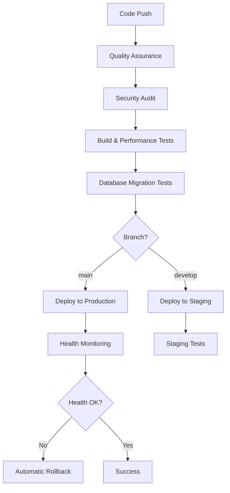

# 🚀 Comprehensive Deployment Pipeline

## 🎯 Overview

This document outlines the robust deployment pipeline implemented for the wedding invitation application, featuring automated testing, security audits, blue-green deployments, and comprehensive monitoring.

## 🏗️ Pipeline Architecture

### **Environment Stages**
1. **Development** (`develop` branch)
2. **Staging** (`develop` branch auto-deploy)
3. **Production** (`main` branch auto-deploy)

### **Pipeline Flow**


## ✅ Implemented Features

### **1. Environment-Specific Configurations**
- **Development**: Local development with hot reload
- **Staging**: Production-like environment for testing
- **Production**: Optimized for performance and security

### **2. Health Checks & Monitoring**
- **Comprehensive Health Endpoints**: `/health`, `/health/ready`, `/health/live`
- **System Metrics**: Memory, CPU, disk usage monitoring
- **Database Health**: Connection pooling and performance metrics
- **Performance Tracking**: Response times and error rates

### **3. Automated Performance Audits**
- **Lighthouse Integration**: Core Web Vitals monitoring
- **Bundle Analysis**: Size optimization and recommendations
- **Performance Thresholds**: Automated pass/fail criteria
- **Historical Tracking**: Performance trends over time

### **4. Rollback Mechanisms**
- **Automated Rollback**: Trigger on health check failures
- **Manual Rollback**: CLI tools for emergency situations
- **Blue-Green Deployment**: Zero-downtime deployments
- **Database Rollback**: Safe migration reversals

### **5. SSL/TLS Configuration**
- **HTTPS Enforcement**: Automatic HTTP to HTTPS redirect
- **HSTS Headers**: Enhanced security headers
- **Certificate Management**: Auto-renewal support
- **Security Best Practices**: Modern cipher suites and protocols

### **6. Database Migration System**
- **Version Control**: Track all database changes
- **Rollback Support**: Safe migration reversals
- **Validation**: Post-migration schema validation
- **Backup Integration**: Automatic pre-migration backups

## 📋 Deployment Scripts

### **Build Commands**
```bash
# Environment-specific builds
npm run build:staging          # Staging build with source maps
npm run build:production       # Production build optimized

# Bundle analysis
npm run build:analyze          # Build with bundle analysis
npm run analyze:bundle         # Analyze existing build
```

### **Migration Commands**
```bash
# Database migrations
npm run migrate:up             # Apply pending migrations
npm run migrate:status         # Show migration status
npm run migrate:rollback       # Rollback specific migration

# Migration options
npm run migrate:up -- --dry-run      # Preview changes
npm run migrate:up -- --force        # Force migration
npm run migrate:up -- --target=name  # Stop at specific migration
```

### **Rollback Commands**
```bash
# Rollback management
npm run rollback:list          # List available rollback targets
npm run rollback:to <version>  # Rollback to specific version
npm run rollback:record        # Record new deployment

# Rollback options
npm run rollback:to <version> -- --dry-run       # Preview rollback
npm run rollback:to <version> -- --skip-db       # Skip database rollback
npm run rollback:to <version> -- --skip-health   # Skip health checks
```

### **Health & Monitoring**
```bash
# Health checks
npm run health:check           # Basic health check
npm run health:detailed        # Detailed health report

# Performance audits
npm run audit:performance      # Run Lighthouse audit
npm run monitor:performance    # Continuous monitoring
```

## 🔧 Configuration Files

### **Environment Configuration** (`config/environments.ts`)
```typescript
export const environments = {
  development: {
    api: { baseUrl: 'http://localhost:5002' },
    database: { ssl: false, poolSize: 5 },
    security: { enableCORS: true, enableCSP: false },
    monitoring: { enableAnalytics: false },
  },
  staging: {
    api: { baseUrl: 'https://staging-api.yourweddingapp.com' },
    database: { ssl: true, poolSize: 15 },
    security: { enableCORS: true, enableCSP: true },
    monitoring: { enableAnalytics: true },
  },
  production: {
    api: { baseUrl: 'https://api.yourweddingapp.com' },
    database: { ssl: true, poolSize: 20 },
    security: { enableCORS: true, enableCSP: true },
    monitoring: { enableAnalytics: true },
  },
};
```

### **Vite Staging Configuration** (`vite.config.staging.ts`)
- Source maps enabled for debugging
- Bundle analysis included
- Moderate optimization settings
- Development-friendly error reporting

### **SSL Configuration** (`server/middleware/ssl.ts`)
```typescript
const SSL_CONFIG = {
  enabled: process.env.NODE_ENV === 'production',
  enforceHTTPS: true,
  hsts: {
    maxAge: 31536000, // 1 year
    includeSubDomains: true,
    preload: true,
  },
  protocols: ['TLSv1.2', 'TLSv1.3'],
};
```

## 🔒 Security Features

### **SSL/TLS Security**
- **HTTPS Enforcement**: Automatic redirects
- **HSTS Headers**: Prevent downgrade attacks
- **Modern Protocols**: TLS 1.2+ only
- **Secure Ciphers**: Strong encryption algorithms

### **Application Security**
- **Content Security Policy**: XSS protection
- **CORS Configuration**: Cross-origin restrictions
- **Security Headers**: Comprehensive protection
- **Input Validation**: SQL injection prevention

### **Database Security**
- **Connection Pooling**: Resource management
- **Prepared Statements**: SQL injection prevention
- **SSL Connections**: Encrypted database traffic
- **Access Control**: Role-based permissions

## 📊 Monitoring & Alerting

### **Health Monitoring**
```json
{
  "status": "healthy",
  "checks": {
    "database": { "status": "pass", "responseTime": 45 },
    "memory": { "status": "pass", "percentage": 62.3 },
    "disk": { "status": "pass", "percentage": 34.1 },
    "cpu": { "status": "pass", "percentage": 23.7 }
  },
  "metadata": {
    "uptime": 3600,
    "version": "1.0.0",
    "environment": "production"
  }
}
```

### **Performance Metrics**
- **Core Web Vitals**: LCP, FID, CLS monitoring
- **Bundle Size**: Automatic size tracking
- **Response Times**: API endpoint monitoring
- **Error Rates**: Application error tracking

### **Alerting Thresholds**
- **Response Time**: > 2000ms (warning), > 5000ms (critical)
- **Error Rate**: > 1% (warning), > 5% (critical)
- **Memory Usage**: > 80% (warning), > 90% (critical)
- **Disk Usage**: > 85% (warning), > 95% (critical)

## 🚀 Deployment Workflow

### **Staging Deployment** (Auto on `develop` push)
1. **Quality Assurance**: Linting, type checking, tests
2. **Security Audit**: Dependency vulnerability scan
3. **Build**: Staging-optimized build with source maps
4. **Database Migration**: Apply pending migrations
5. **Health Check**: Verify deployment success
6. **Performance Test**: Lighthouse audit

### **Production Deployment** (Auto on `main` push)
1. **All Staging Steps**: Complete QA and testing
2. **Database Backup**: Pre-deployment backup
3. **Blue-Green Deploy**: Zero-downtime deployment
4. **Health Monitoring**: 5-minute monitoring window
5. **Automatic Rollback**: On health check failure
6. **Success Notification**: Team notification

### **Manual Rollback Process**
```bash
# List available rollback targets
npm run rollback:list

# Rollback to specific version
npm run rollback:to v1.2.3

# Emergency rollback (skip validations)
npm run rollback:to v1.2.3 -- --skip-health --skip-db
```

## 📁 File Structure

```
project/
├── .github/workflows/
│   └── deploy.yml              # GitHub Actions pipeline
├── config/
│   └── environments.ts         # Environment configurations
├── scripts/deployment/
│   ├── migrate.js              # Database migration system
│   └── rollback.js             # Rollback management
├── scripts/
│   └── performance-audit.js    # Performance testing
├── server/middleware/
│   ├── ssl.ts                  # SSL/TLS configuration
│   └── imageOptimization.ts    # Image optimization
├── server/monitoring/
│   └── healthChecks.ts         # Health monitoring
├── vite.config.staging.ts      # Staging build config
└── DEPLOYMENT_PIPELINE.md      # This documentation
```

## 🎯 Performance Targets

### **Core Web Vitals**
- **LCP (Largest Contentful Paint)**: < 2.5s
- **FID (First Input Delay)**: < 100ms
- **CLS (Cumulative Layout Shift)**: < 0.1

### **Bundle Size Targets**
- **Initial Bundle**: < 500KB (gzipped)
- **Total JavaScript**: < 2MB (gzipped)
- **Lighthouse Score**: > 90

### **Infrastructure Targets**
- **Uptime**: 99.9%
- **Response Time**: < 500ms (95th percentile)
- **Error Rate**: < 0.1%

## 🛠️ Troubleshooting

### **Common Issues**

1. **Deployment Failures**
   ```bash
   # Check health status
   npm run health:detailed
   
   # Review migration status
   npm run migrate:status
   
   # Manual rollback if needed
   npm run rollback:to <previous_version>
   ```

2. **Performance Issues**
   ```bash
   # Run performance audit
   npm run audit:performance
   
   # Analyze bundle size
   npm run analyze:bundle
   
   # Check resource usage
   curl -s /health | jq '.metadata'
   ```

3. **SSL Certificate Issues**
   ```bash
   # Check certificate expiry
   openssl s_client -connect yoursite.com:443 -servername yoursite.com | openssl x509 -noout -dates
   
   # Renew certificate (Let's Encrypt)
   certbot renew --dry-run
   ```

### **Emergency Procedures**

1. **Immediate Rollback**
   ```bash
   npm run rollback:to <last_known_good> -- --skip-health
   ```

2. **Database Recovery**
   ```bash
   # Restore from backup
   psql $DATABASE_URL < backup-file.sql
   ```

3. **Service Restart**
   ```bash
   # Restart application
   pm2 restart wedding-app
   # or
   sudo systemctl restart wedding-app
   ```

## 📞 Support & Maintenance

### **Monitoring Dashboards**
- **Application Health**: `/health` endpoint
- **Performance Metrics**: Lighthouse reports
- **Database Metrics**: Connection pool status
- **Infrastructure**: Server resource usage

### **Log Locations**
- **Application Logs**: `/var/log/wedding-app/`
- **Access Logs**: `/var/log/nginx/`
- **Database Logs**: PostgreSQL logs
- **Deployment Logs**: GitHub Actions

### **Contact Information**
- **DevOps Team**: devops@yourweddingapp.com
- **On-Call**: +1-xxx-xxx-xxxx
- **Slack**: #deployment-alerts

---

**Last Updated**: January 2025  
**Pipeline Version**: 2.0.0  
**Status**: ✅ Production Ready
